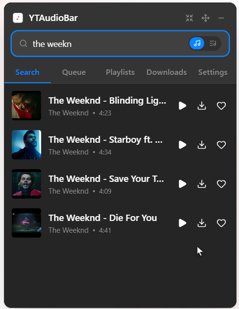
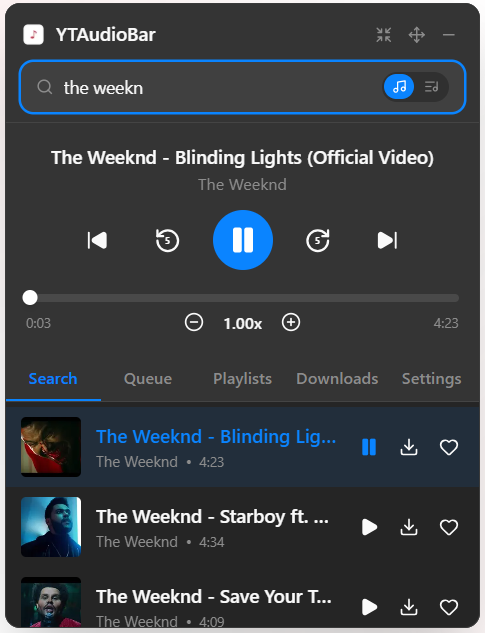
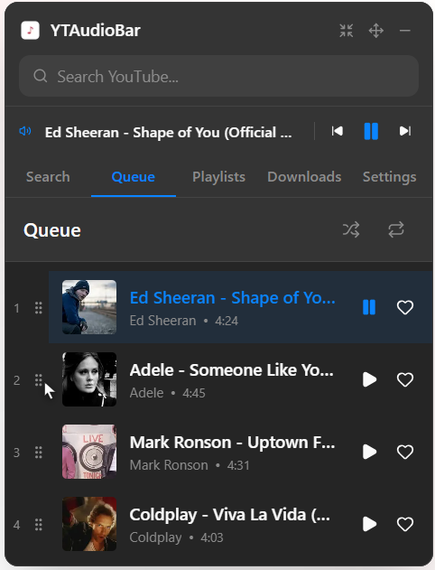
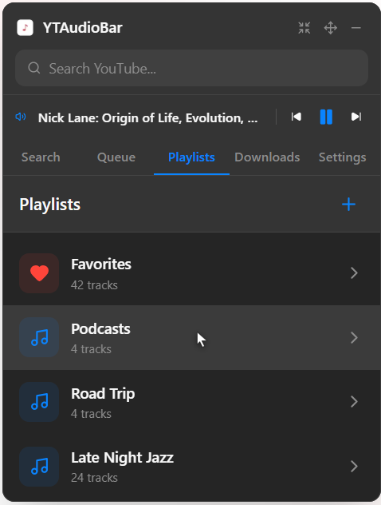
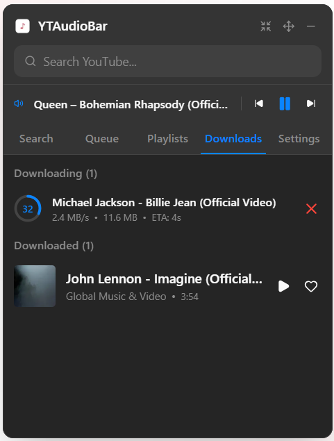

# YTAudioBar

[](https://opensource.org/licenses/MIT)
[](https://github.com/ilyassan/ytaudiobar/releases)
[](https://github.com/ilyassan/ytaudiobar/releases)

<div align="center">
  
</div>

A feature-rich desktop application for streaming and downloading YouTube audio on **macOS, Windows, and Linux**. Extract audio from YouTube videos, stream them directly, or download for offline listening with a Spotify-inspired interface.

## Contents

- [Screenshots](#screenshots)
- [Features](#features)
- [Installation](#installation)
- [Usage](#usage)
- [System Requirements](#system-requirements)
- [Development](#development)
- [Project Structure](#project-structure)
- [Analytics](#analytics)
- [Contributing](#contributing)
- [License](#license)

## Screenshots

<div align="center">
  
  
  
  
  
</div>

<div align="center">

https://github.com/user-attachments/assets/81d926c4-cb42-4ab1-8861-8741357bdbc3

</div>

## Features

- **Stream YouTube Audio** — Play high-quality audio directly from YouTube with intuitive playback controls
- **Download for Offline** — Download tracks locally (MP3/M4A/OGG, selectable quality up to 320kbps) with automatic metadata
- **Queue Management** — Build and manage playback queues on the fly
- **Unlimited Playlists** — Create custom playlists and organize your music collection
- **Fast Seeking** — Seek instantly in both downloaded and streamed tracks via ffmpeg
- **OS Media Controls** — Full integration with macOS Now Playing, Windows SMTC, and Linux MPRIS
- **Media Key Support** — Control playback with media keys (Play, Pause, Next, Previous, Seek)
- **Search Modes** — Toggle between general search and music-optimized search
- **System Tray / Menu Bar** — Lives in the menu bar on macOS, system tray on Windows/Linux
- **Auto-start** — Optional automatic startup with your system

## Installation

### macOS

Download the latest `.dmg` from [GitHub Releases](https://github.com/ilyassan/ytaudiobar/releases).

1. Open the `.dmg` and drag **YTAudioBar.app** to your Applications folder
2. On first launch, right-click the app and choose **Open** (required once to bypass Gatekeeper for unsigned apps)
3. YTAudioBar will appear in your menu bar — on first launch it will automatically download `yt-dlp` and `ffmpeg` (~15 MB)

Minimum requirements: macOS 11.0 (Big Sur) or later, Apple Silicon or Intel

### Windows

Download the latest `.exe` installer from [GitHub Releases](https://github.com/ilyassan/ytaudiobar/releases) or the [official website](https://ytaudiobar.vercel.app/download).

1. Download `YTAudioBar_x64-setup.exe`
2. Run the installer
3. On first launch, the app will automatically download `yt-dlp` and `ffmpeg` (~15 MB)

Minimum requirements: Windows 10 or later

### Linux

#### Arch Linux (AUR)

The easiest way to install on Arch Linux is via the AUR:

```bash
# Using an AUR helper like yay
yay -S ytaudiobar-git
```

#### Flatpak (Universal)

Run anywhere (Arch, Fedora, Ubuntu, etc.) with sandboxed security:

```bash
# Build and install locally
flatpak-builder --user --install --force-clean build-dir com.ytaudiobar.app.yml
```

#### AppImage

1. Download `YTAudioBar_*.AppImage` from [GitHub Releases](https://github.com/ilyassan/ytaudiobar/releases)
2. Make it executable: `chmod +x YTAudioBar_*.AppImage`
3. Run: `./YTAudioBar_*.AppImage`

#### Debian/Ubuntu (.deb)

Download the `.deb` package from the releases page and install:

```bash
sudo apt install ./YTAudioBar_*.deb
```

Minimum requirements: Ubuntu 22.04+, Arch Linux, or any distribution with WebKit2GTK support.

## Usage

### Basic Playback

1. Use the **Search** tab to find YouTube videos
2. Click a result to start playback
3. Use playback controls or media keys
4. Adjust volume and seek through the track

### Downloads

Switch to the **Downloads** tab to:

- View download progress
- Download tracks for offline playback
- Downloaded tracks support full seeking and faster playback

### Playlists

1. Click the **Playlists** tab
2. Create new playlists with the `+` button
3. Add tracks via the playlist icon during playback
4. Organize your music collection

### Settings

Access **Settings** tab to:

- Enable/disable auto-start on system boot
- Configure output device (if available)
- Adjust UI preferences

### macOS

- **OS:** macOS 11.0 (Big Sur) or later
- **RAM:** 256 MB minimum
- **Disk Space:** ~5 MB for installation + 15 MB for runtime dependencies (downloaded on first launch)

### Windows

- **OS:** Windows 10 or later (tested on Windows 11)
- **RAM:** 256 MB minimum
- **Disk Space:** ~5 MB for installation + 15 MB for runtime dependencies (downloaded on first launch)

### Linux

- **OS:** Ubuntu 22.04+ or equivalent distribution
- **RAM:** 256 MB minimum
- **Disk Space:** ~70 MB for AppImage + 15 MB for runtime dependencies (downloaded on first launch)
- **Dependencies:** libssl, libxcb (automatically handled by AppImage)

## Development

### Prerequisites

- Rust 1.70+ ([Install Rust](https://rustup.rs/))
- Node.js 16+ ([Install Node.js](https://nodejs.org/))
- Visual Studio Build Tools (Windows) or standard C compiler (Linux)

### Setup

```bash
# Clone the repository
git clone https://github.com/ilyassan/ytaudiobar.git
cd YTAudioBar-tauri

# Install dependencies
npm install

# Install Rust dependencies
cd src-tauri && cargo fetch && cd ..
```

### Development Build

```bash
# Run in development mode with hot reload
npm run tauri dev
```

### Production Build

```bash
# Build optimized release
npm run tauri build
```

### Type Checking

```bash
npx tsc --noEmit
```

### Testing

```bash
# Frontend unit tests (Vitest)
npm test

# Backend unit tests (Rust) -- requires a built frontend first, since
# tauri::generate_context!() needs ../dist to exist
npm run build
cd src-tauri && cargo test
```

CI runs both suites (plus the type check) on every push/PR to `main` — see
[`.github/workflows/ci.yml`](.github/workflows/ci.yml).

### Technology Stack

**Frontend:**

- React
- TypeScript
- Tauri IPC
- TailwindCSS
- Zustand (state management)
- Vitest + React Testing Library (tests)

**Backend:**

- Tauri 2.x
- FFmpeg (audio decoding — a single subprocess pipeline for both streamed and downloaded tracks)
- rodio (audio output)
- SQLite (sqlx)
- reqwest
- yt-dlp

### Audio Pipeline

```
YouTube URL or local file
    ↓
yt-dlp (resolve stream URL, streaming only)
    ↓
ffmpeg (decode to raw PCM — same path for local files and streams)
    ↓
rodio Sink (output)
```

### Playback Modes

- **Downloaded Tracks:** ffmpeg decodes directly from the local file; seeking uses ffmpeg's `-ss` flag
- **Streamed Tracks:** ffmpeg decodes directly from the resolved stream URL; seeking re-spawns ffmpeg at the new offset

## Project Structure

```
src/                               Frontend (React)
├── features/
│   ├── player/                   Player UI components
│   ├── search/                   Search functionality
│   ├── queue/                    Queue management
│   ├── playlists/                Playlist UI
│   ├── downloads/                Downloads UI
│   └── settings/                 Settings UI
├── hooks/                        Keyboard shortcuts, OS media-key wiring
├── stores/                       State management (Zustand): player,
│                                  downloads, favorites, toasts
├── components/                   Shared UI (track-item, toast-container, ...)
├── lib/tauri.ts                  IPC bindings
└── app/routes/home.tsx           Main page

src-tauri/                        Backend (Rust)
├── src/
│   ├── main.rs                   App setup, window/tray, event wiring
│   ├── commands/                 Tauri command handlers, split by domain
│   │   ├── search.rs, playback.rs, queue.rs, library.rs,
│   │   │   downloads.rs, settings.rs, window.rs, media_keys.rs
│   ├── audio_manager.rs          Audio playback (ffmpeg subprocess pipeline)
│   ├── download_manager.rs       Downloads
│   ├── queue_manager.rs          Playback queue, shuffle/repeat
│   ├── media_key_manager.rs      OS media controls
│   ├── database.rs               SQLite management
│   ├── ytdlp_manager.rs          yt-dlp search/extraction
│   ├── ytdlp_installer.rs        yt-dlp download/update
│   ├── ffmpeg_installer.rs       ffmpeg download/update
│   ├── analytics.rs              Anonymous, aggregate usage analytics (see below)
│   └── models.rs                 Data structures
└── Cargo.toml                    Rust dependencies
```

## Analytics

YTAudioBar collects anonymous, aggregate usage analytics (via a self-hosted
[Umami](https://umami.is/) instance) to understand feature usage at a high
level — things like app launches, play/download/search counts, and error
rates. Each install gets a random, locally-generated id with no link to any
account. We never collect search queries, track/playlist titles, video IDs,
file paths, or anything else that reveals what you specifically played,
searched for, or downloaded. See
[`src-tauri/src/analytics.rs`](src-tauri/src/analytics.rs) for the exact list
of events and implementation.

## Contributing

Contributions are welcome! See [CONTRIBUTING.md](CONTRIBUTING.md) for guidelines.

## License

This project is licensed under the MIT License. See the [LICENSE](LICENSE) file for details.

## Credits

- **[ilyassan](https://github.com/ilyassan)** — Original creator and lead developer.
- **[A-007481D](https://github.com/A-007481D)** — Linux contributor (Universal Linux support, Arch Linux/AUR packaging, and Flatpak implementation).

## Related Projects

- [yt-dlp](https://github.com/yt-dlp/yt-dlp) — YouTube audio extraction
- [Tauri](https://tauri.app/) — Desktop app framework
- [FFmpeg](https://ffmpeg.org/) — Audio decoding
- [rodio](https://github.com/RustAudio/rodio) — Audio output library

---

Made by Ilyass for the open source community
